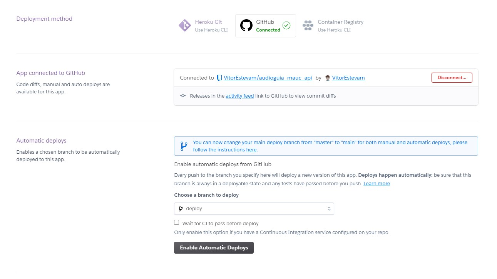
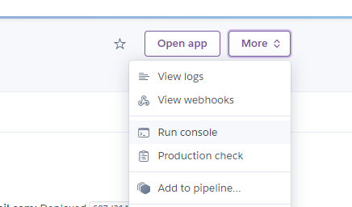

## Aviso
O deploy no heroku não é efetivo, pois os arquivos estáticos são apagados diáriamente. é necessária a hospedagem do banco em um ambiente externo

https://help.heroku.com/K1PPS2WM/why-are-my-file-uploads-missing-deleted

# Django rest framework + heroku 

Hospedar a aplicação no heroku é simples. o Aquivo "Procfile" vai ser o resposável pela configuração na plataforma.

```
web: gunicorn maucproject.wsgi
```

Após isso, basta acessar o heroku e escolher a forma de enviar os arquivos para lá. No caso dessa aplicação eu preferi criar uma branch [Deploy](https://github.com/VitorEstevam/audioguia_mauc_api/tree/deploy) para guardar os arquivos que são enviados para lá e linkei o repositório ao Heroku.



## configurações no heroku

No menu more vá em "Run console"

  

Rode os seguintes comandos

```
python manage.py migrate
```

```
python manage.py createsuperuser
```
siga as instruções para criar um admin

## Referências

- https://ultimatedjango.com/learn-django/lessons/push-to-heroku/
- https://stackoverflow.com/questions/40980717/django-programmingerror-relation-does-not-exists
