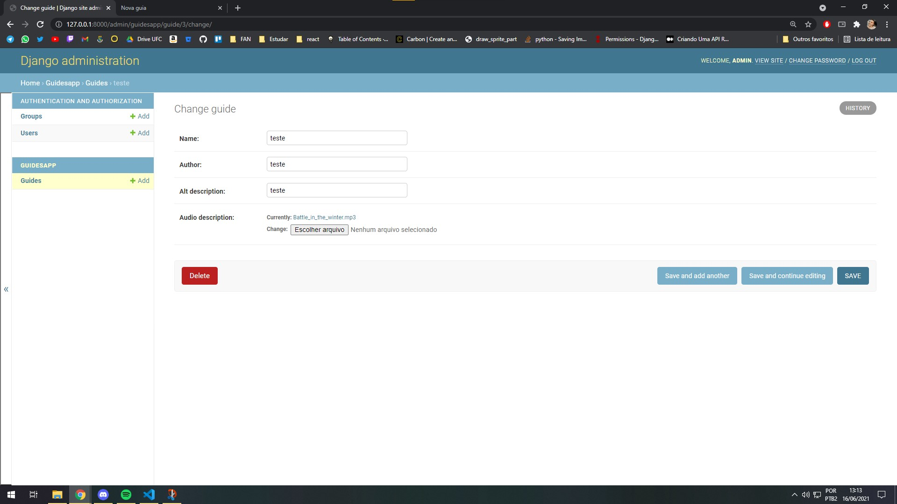

# API AUDIO GUIA MAUC

REST API feita com [Django rest framework](https://www.django-rest-framework.org/) para ser usado na construção do app audio guia do Museu de Arte da Universidade Federal do Ceará.

## como hospedadar no Heroku

acesse o [heroku-docs.md](./docs/heroku-docs.md) para informações detalhadas

## Como rodar localmente

<details>
<summary>Como rodar localmente</summary>
<br>
  
Instala o [Python](https://www.python.org/ftp/python/3.9.5/python-3.9.5-amd64.exe) 
  
```
  Siga as instruções do instalador
```

Instala as dependências

```bash
  pip install django
  pip install djangorestframework
```

Clona o projeto

```bash
  git clone https://link-to-project
```

Acessa o diretório do projeto

```bash
  cd maucproject
```

Roda a aplicação

```bash
  python manage.py runserver
```
</details>

  
## API Reference

### Página de admin
```
  Acesse /admin

  user: admin
  password: admin
```

### Documentação dos endpoints pelo postman
  https://documenter.getpostman.com/view/15025870/TzmChYvb

<details>
  <summary>documentação detalhada dos endpoints</summary>
### Get all guides

```http
  GET /api/guides
```

Recebe uma lista de Guides

### Get guide

```http
  GET /api/guides/id
```

| field | Type     | Description                       |
| :-------- | :------- | :-------------------------------- |
| `id`      | `int` | a id do item |
| `name`      | `string` | nome da obra|
| `author`      | `string` | nome do autor|
| `alt_description`      | `string` | descrição textual da obra|
| `audio_description`      | `file` | audio descrição da obra|

Recebe um guide
  
</details>

## Referências

 - [Como criar uma API com django rest framework I](https://medium.com/@marcosrabaioli/criando-uma-api-rest-utilizando-django-rest-framework-parte-1-55ac3e394fa)   
 - [Como criar uma API com django rest framework II](https://www.django-rest-framework.org/tutorial/quickstart/)
 - [Como criar um diretório static no projeto](https://stackoverflow.com/questions/62737136/saving-image-file-in-particular-directory-in-django-rest-framework)
 - [Como impedir Requests de escrita não autenticados](https://www.django-rest-framework.org/api-guide/permissions/)
 
## Screenshots



<details>
<summary>Sugestões de melhoria</summary>
Hospedar o banco de forma separada para evitar que os deploys quebrem os dados que tão salvos na pasta static
</details>
